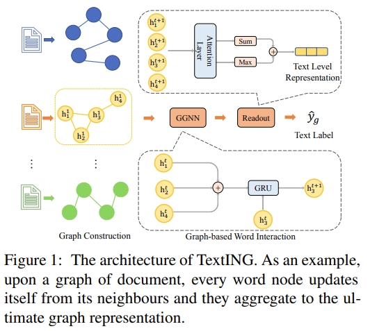

# TextING



This is the code for the ACL 2020 Paper: [Every Document Owns Its Structure: Inductive Text Classification via Graph Neural Networks](https://aclanthology.org/2020.acl-main.31/).

## Usage

Download pre-trained word embeddings `glove.6B.300d.txt` from [here](http://nlp.stanford.edu/data/glove.6B.zip) and unzip to the repository.

Build graphs from the datasets in `data/corpus/` as:

    python build_graph.py [DATASET] [WINSIZE]

Provided datasets include `mr`,`ohsumed`,`R8`and`R52`. The default sliding window size is 3.

To use your own dataset, put the text file under `data/corpus/` and the label file under `data/` as other datasets do. Preprocess the text by running `remove_words.py` before building the graphs.

Start training and inference as:

    python train.py [--dataset DATASET] [--learning_rate LR]
                    [--epochs EPOCHS] [--batch_size BATCHSIZE]
                    [--hidden HIDDEN] [--steps STEPS]
                    [--dropout DROPOUT] [--weight_decay WD]

To reproduce the result, large hidden size and batch size are suggested as long as your memory allows. We report our result based on 96 hidden size with 1 batch. For the sake of memory efficiency, you may change according to your hardware.


## Requirements

* Python 3.6+
* Tensorflow/Tensorflow-gpu 1.12.0
* Scipy 1.5.1

## Citation

Please cite our paper if you use the code:
```
@inproceedings{zhang-etal-2020-every,
    title = "Every Document Owns Its Structure: Inductive Text Classification via Graph Neural Networks",
    author = "Zhang, Yufeng  and
      Yu, Xueli  and
      Cui, Zeyu  and
      Wu, Shu  and
      Wen, Zhongzhen  and
      Wang, Liang",
    editor = "Jurafsky, Dan  and
      Chai, Joyce  and
      Schluter, Natalie  and
      Tetreault, Joel",
    booktitle = "Proceedings of the 58th Annual Meeting of the Association for Computational Linguistics",
    month = jul,
    year = "2020",
    address = "Online",
    publisher = "Association for Computational Linguistics",
    url = "https://aclanthology.org/2020.acl-main.31",
    doi = "10.18653/v1/2020.acl-main.31",
    pages = "334--339",
    abstract = "Text classification is fundamental in natural language processing (NLP) and Graph Neural Networks (GNN) are recently applied in this task. However, the existing graph-based works can neither capture the contextual word relationships within each document nor fulfil the inductive learning of new words. Therefore in this work, to overcome such problems, we propose TextING for inductive text classification via GNN. We first build individual graphs for each document and then use GNN to learn the fine-grained word representations based on their local structure, which can also effectively produce embeddings for unseen words in the new document. Finally, the word nodes are aggregated as the document embedding. Extensive experiments on four benchmark datasets show that our method outperforms state-of-the-art text classification methods.",
}
```

## Acknowledge

Some functions are based on [Text GCN](https://github.com/yao8839836/text_gcn). Thank for their work.
